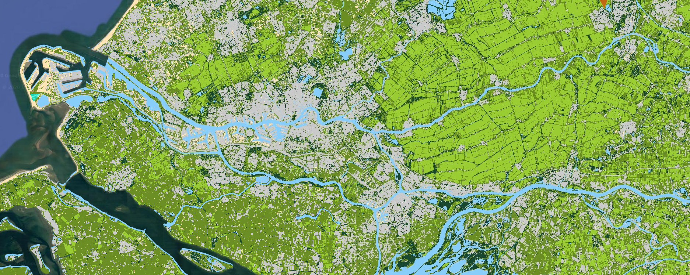
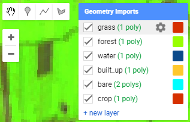
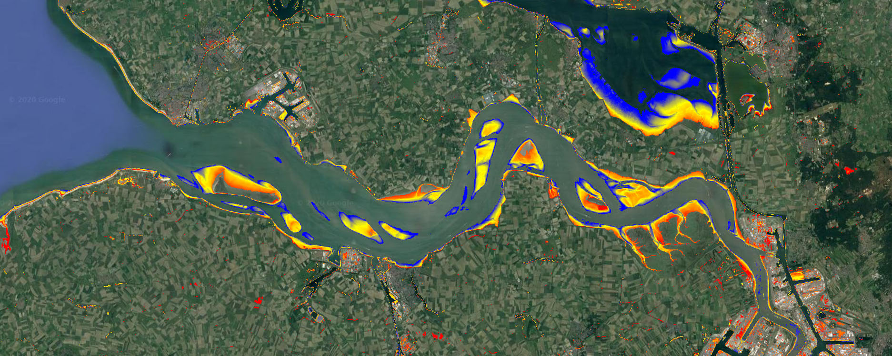
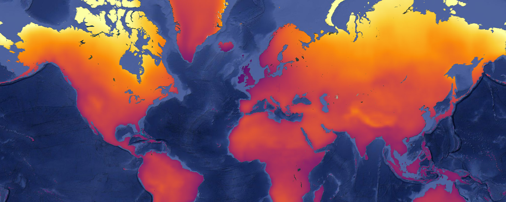
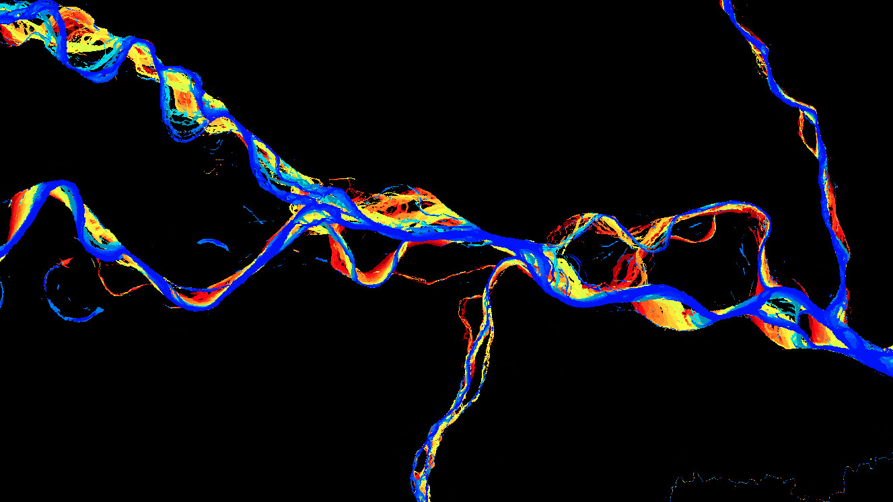

```{r setup, include=FALSE}
knitr::opts_chunk$set(echo=T, eval=F)
```


# Introduction {-}

```{r eval=T, echo=F, out.width="100%"}

```

*I developed this content originally in September 2018 for an internal workshop at the Department of Physical Geography of Utrecht University.*

&nbsp;

The exercises of this workshop are meant to give you an idea of the capabilities of Google Earth Engine. Some code uses intermediate to advanced concepts and because of the different level of the workshop participants, all code has been pre-written and ready for copy-paste. More advanced participants are encouraged to dive deeper into the code, add additional code, and find their own solutions, and help others in understanding the analyses and code.


## Earth Engine access {-}

To use Google Earth Engine you need to [sign up](https://earthengine.google.com/new_signup/) for the service first using a Google account.


## Earth Engine help {-}

There are various ways you can search for help on Earth Engine coding, among others:

- Function help is available through the *docs* tab on the top left panel of the web interface.
- A concise [user guide](https://developers.google.com/earth-engine/) with clear examples is accessible via the help dropdown menu in the top right corner of the web interface.
- The developer discussion group is accessible via the help dropdown menu in the top right corner of the web interface. It has many discussions on a plethora of topics and often with example code written by other developers.
- Community-driven [tutorials](https://developers.google.com/earth-engine/tutorials/community/beginners-cookbook) and [training material](https://developers.google.com/earth-engine/tutorials/ttt) are available from Google.


## Workshop code {-}

A script repository that holds working code of all the exercises as well as of additional cases can be added to your own Earth Engine environment using the following URL:  
<https://code.earthengine.google.com/?accept_repo=users/philipkraaijenbrink/dpg-workshop>

My [`earthengine-tools`](https://github.com/kraaijenbrink/earthengine-tools) repository contains additional functions that are called by the scripts in this manual. To review this code and/or assess its functionality you can visit:
<https://github.com/kraaijenbrink/earthengine-tools>


## Source {-}

The source code of this manual, exercises and cases is available at:  
<https://github.com/kraaijenbrink/earthengine-workshop>


&nbsp;


© 2020 Philip Kraaijenbrink. This document is licensed under the Creative Commons Attribution-ShareAlike 4.0 International license (CC BY-SA 4.0)

```{r eval=T, echo=F, out.width="101 px"}

```


# Image classification



**Generate a Landsat 8 composite image, perform a land cover classification of the image, and compare class distribution over elevation in the Netherlands.**


## Define input data

First you will need to define the datasets to use. In this exercise you will use Landsat 8 surface reflectance data, AHN elevation data, and vector outlines of the Netherlands and dutch provinces. Copy and paste the lines below to a blank script:

```{js}
// get landsat data from catalog
var landsat  = ee.ImageCollection('LANDSAT/LC08/C01/T1_SR')
 
// get only scenes that overlap with NL, have less than 10% cloud cover, and
// fall in the period 2015-2017
var nl      = ee.FeatureCollection('users/philipkraaijenbrink/dpg-workshop/rijksgrens_nl')
var landsat = landsat.filterBounds(nl)
                     .filterDate('2015-01-01','2017-12-31')
                     .filter(ee.Filter.lte('CLOUD_COVER', 10))
 
// select subsat of image bands and rename them for easier reference
// first select band subset, then loop over images in collection and rename the bands
var landsat = landsat
  .select(['B2','B3','B4','B5','B6','B7','B10']) 
  .map(function(x){return x.rename(['blue','green','red', 'nir','swir1','swir2','tir'])})
```
&nbsp;

To get a quick cloud free composite of the filtered Landsat 8 image collection, use a median reducer to generate a single composite image whose pixels comprise the median value of the collection. Using the median makes sure that the cloud pixels are not selected because they are always close to the maximum values.

```{js}
// for every pixel, get the median pixel value of all images in the collection
// for a quick way to filter clouds and possible artefacts
var satimg = landsat.median()
 
// clip the result to the outline of NL
var satimg = satimg.clip(nl)
```


## Obtain training data

Visualize the data using `Map.addLayer()`, similar to example code on the previous page. Select a band combination that clearly shows the different land cover types.

To perform classification of the composite image you first need to define training data. This is performed by drawing polygons on the image to sample pixels of a land cover class. In this exercise you will classify the following classes:
*grassland, forest, water, built-up, bare, cropland*

Draw polygons for each of the land cover classes using the drawing tools of Earth Engine (in the top left corner of the map). Do not make the polygon too large and try to limit contamination by pixels that are not supposed to be part of the class, e.g. do not let the built-up polygon partly cover a park.

For each class, you should generate a new layer. In the layer settings (accessible via the gear icon that appears when hovering over the layer) give the layer a name, set the import type to ‘feature’ and add a property “class”. Set the class value for each cover type to a unique numerical value (0 to 5). If necessary, there can be multiple polygons per class. Don’t mind the colors for now, you will assign them in a later stage.

&nbsp;

```{r eval=T, echo=F, out.width="317 px", fig.cap="Drawing tools and layers currently drawn."}

```

&nbsp;

```{r eval=T, echo=F, out.width="395 px", fig.cap="The geometry settings dialog."}
knitr::include_graphics('figures/geometry-settings-dialog.png', )
```

&nbsp;


When you have created the polygons for all classes, combine them into a feature collection using the following code (check whether the layer names match yours).

```{js}
// combine the sample regions you've create into a single collection
var sampleregs  = ee.FeatureCollection([grass,forest,water,built_up,bare,crop])
```


## Classify image

Using the polygons, we will now sample pixels from the image and use them as training data for the classification algorithm. You will use a simple minimum distance classifier, but there are many more advanced options available. To generate the classified image use:

```{js}
// selection of bands to use for classification algorithm
var bands	= ['green','red','nir','swir1','swir2']
 
// sample pixels from the image using the regions
var training = satimg.sampleRegions({
  collection: sampleregs,
  properties: ['class'],
  scale: 30
})

// define classifier and train with the samples
var mdmodel  = ee.Classifier.minimumDistance('euclidean')
var trained  = mdmodel.train(training, 'class', bands)

// apply classifier to the image
var classimg = satimg.classify(trained)
```
&nbsp;

Define a list with class names, values and display colors to use for mapping and charting:

```{js}
// lists with class names, values and colors (for colors use hex RGB or html5 color names)
var classlab = ['Grassland','Forest','Water','Built-up','Bare','Cropland']
var classval = [0,1,2,3,4,5]
var classcol = ['YellowGreen', '184930', 'LightSkyBlue', '#cacaca', 'Moccasin', 'OliveDrab']  
```
&nbsp;

Add the classification to the map using:
```{js}
Map.addLayer(classimg, {min:0, max:5, palette: classcol}, 'Classification',true)
```
&nbsp;

If you would like, you can add a quick legend to the map using this predefined function:
```{js}
var lg = require('users/philipkraaijenbrink/tools:legends')
lg.classLegend(classval, classlab, classcol)
```
&nbsp;

Evaluate the classification accuracy. Has it performed well? If not, change your polygons and/or add extra.


## Visualize using charts

To get information about the class distribution in the Netherlands, generate a barchart showing approximate area per class. This can be done using the following code:

```{js}
// chart that shows class area distribution
var nl = ee.FeatureCollection('users/philipkraaijenbrink/dpg-workshop/rijksgrens_nl')
var chart = ui.Chart.image.byClass({
  image: ee.Image.pixelArea().multiply(1e-6)        // pixel area in km2
            .addBands(classimg.rename('classification')),
  classBand: 'classification',                     
  region: nl,
  reducer: ee.Reducer.sum(),
  scale: 30*30,
  classLabels: classlab,
})
chart.setOptions({title:'Area per class', hAxis: {title: ''}, vAxis: {title: 'Area (km2)'},
                 colors: classcol})
     .setChartType('ColumnChart')
print(chart)
```
&nbsp;

To get a sense of class distribution with elevation in the Netherlands, first extract elevation bands from the detailed 0.5 m resolution elevation model Algemeen Hoogtebestand Nederland (AHN):

```{js}
// get equidistant elevation bands from AHN for charting
var elev = ee.Image('AHN/AHN2_05M_INT')     // get AHN dataset from catalog
var stepping  = 1.0                         // elevation step size
var elevsteps = ee.List.sequence(-5,50,stepping)     // get steps in range
var itr = ee.List.sequence(0,elevsteps.length().subtract(1),1)  // iterator list to loop over
var elevbands   = ee.ImageCollection.fromImages(itr.map(function(i){  // loop over iterator i
  var elevthres =  ee.Number(elevsteps.get(i))                        // get elev_i
  var elevband = elev.lte(elevthres).and(elev.gt(elevthres.subtract(stepping))) // elev band
  var onlyband = elevband.updateMask(elevband.eq(1))         // mask everything but true
  return onlyband.set('system:index',ee.Number.parse(i).format('%04d'))  // set image index
}))
```
&nbsp;

Make a chart of the elevation bands that evaluates the area per class per elevation band:

```{js}
// make chart of pixel count per class per elevation band
var chart = ui.Chart.image.byClass({
  image: elevbands.toBands().addBands(classimg.rename('classification')),
  classBand: 'classification',
  region: nl,
  reducer: ee.Reducer.sum(),
  scale: 30*30,
  classLabels: classlab,
  xLabels: elevsteps.getInfo(),
})
chart.setOptions({title:'Land cover with elevation', hAxis: {title: 'Elevation (m)'},
              	lineWidth: 2, pointSize: 0, colors: classcol, isStacked: 'absolute'})
     .setChartType('AreaChart')
print(chart)
```  
&nbsp;

To determine the fractional coverage of each elevation band, change the string *absolute* to *relative* or *percent* in the `setOptions()` function in the code above.

You can also summarize images for every region in a vector dataset using `ui.Chart.image.byRegion()`. For example class area per province in the Netherlands:

```{js}
// make a chart for class distribution in each province
var prov = ee.FeatureCollection('users/philipkraaijenbrink/dpg-workshop/provincies_nl')
var sepclass = ee.Image(ee.List(classval).iterate(
  function(x,y){return ee.Image(y).addBands(classimg.eq(ee.Image.constant(x)))},
  ee.Image().select()))
var chartlab = []; classval.forEach(function(val,i){chartlab.push(val+' '+classlab[i])});
var chart = ui.Chart.image.byRegion({
  image: sepclass.rename(chartlab),
  regions: prov,
  reducer: ee.Reducer.sum(),
  scale: 30*30,
  xProperty: 'provincien',
}).setChartType('ColumnChart').setOptions({colors: classcol, isStacked: 'percent'})
print(chart)
```
&nbsp;


# Quality mosaicking



**Use a quality mosaicking approach to get both a low tide and high tide image composite, and classify water using simple thresholding on water index to generate a map showing intertidal area.**


## Define input data

First we need to define the datasets that we will use. In this exercise you will use Landsat 8 [top of atmosphere reflectance](http://gsp.humboldt.edu/olm_2015/Courses/GSP_216_Online/lesson4-1/radiometric.html) data. Copy and paste the lines below to a blank script:

```{js}
// Settings ======================================
var cloudcov = 20;
var imageQ   = 8;
 
// get data
var ls8rfl = ee.ImageCollection("LANDSAT/LC08/C01/T1_TOA");	
var westerschelde = ee.Geometry.Point(3.83,51.42);
 
// filter the landsat 8 collection and rename bands
var ls8rfl = ls8rfl
    	.filter(ee.Filter.lte('CLOUD_COVER',cloudcov))
    	.filter(ee.Filter.gte('IMAGE_QUALITY_OLI',imageQ))	
    	.map(function(x){
      	return x.select(['B2','B3','B4','B5','B6','B10','B7','BQA'])
              	.rename(['blue','green','red','nir','swir1','tir','swir2', 'bqa'])
      });
```


## Mask clouds and calculate index

Often satellite imagery comes with metadata on the quality of the acquired imagery. This can be overall quality indication, such as used above, but also a quality image band, which holds predetermined information on quality of each pixel in the image. Using the cloud and cloud shadow flags in this band, the cloud pixels can be masked for each image in a loop over the image collection.

Because you will need a water index per image in the analysis later on, it is calculated directly in the same loop. The water index that is calculated here is the Normalized Difference Water Index ([NDWI](https://www.sentinel-hub.com/eoproducts/ndwi-normalized-difference-water-index)), which ranges from -1 (no water) to 1 (water). 

```{js}
// apply cloud mask on per-image basis and add Normalized Difference Water Index band
var util = require('users/philipkraaijenbrink/tools:utilities')	// load philip's util functions
var lsmasked = ls8rfl.map(function(x){           // loop over image collection
  var cldmask = util.getQAFlags(x.select('bqa'),4,4,'clouds') // get cloud mask from QA band
  var shdmask = util.getQAFlags(x.select('bqa'),7,8,'shadow') // get cloud shadow mask
  var masked  = x.updateMask(cldmask.eq(0))                   // apply both masks to the image
             	.updateMask(shdmask.lte(1))
  var index   = x.normalizedDifference(['green', 'nir'])      // calculate NDWI
             	.rename('index')
  var invindex = ee.Image.constant(0).subtract(index) .rename('invindex')// get inverted index 
  return masked.addBands(index).addBands(invindex)   // return masked image incl. index bands
})
```


## Quality mosaic composite

Using the cloud masked imagery, you can now reduce the image collection to two image composites by sorting, on a pixel level, the Landsat images in the collection using the calculated NDWI values. This is performed using `qualityMosaic()` (see [doc](https://developers.google.com/earth-engine/ic_composite_mosaic)), which determines for each pixel in the composite image the image in the collection that has the maximum pixel value for the band specified.


```{js}
// for each spatial pixel select the image that has the lowest/highest NDWI value
// in the entire (filtered) LS8 image collection
var minwat  = lsmasked.qualityMosaic('invindex');
var maxwat  = lsmasked.qualityMosaic('index');
var meanwat = lsmasked.mean();
```
&nbsp;

Add the data to the map and inspect the results:
```{js}
// add data to map
Map.centerObject(westerschelde, 11);
var vis_params = {min:0, max:0.3, bands:['swir1','nir','green']};
Map.addLayer(minwat,  vis_params, 'LT composite',   true);
Map.addLayer(maxwat,  vis_params, 'HT composite',   false);
Map.addLayer(meanwat, vis_params, 'Mean composite', false);
```


## Classify water

Classification of water areas can be performed by applying a threshold on the NDWI values of the image composite. Here, classify the pixels as water when $\rm{NDWI}>=0.2$. This will create a boolean land-use map with two classes: water = 1, land = 0. 

```{js}
// classify water on both images using NDWI threshold
var lotide = minwat.select('index').gte(0.2);
var hitide = maxwat.select('index').gte(0.2);
 
// inspect classifications
Map.addLayer(lotide, {palette:['darkgreen','lightblue']}, 'Low tide',true);
Map.addLayer(hitide, {palette:['darkgreen','lightblue']}, 'High tide',true);
```
&nbsp;

Are you satisfied with the classification results?  


A better classification can probably be achieved by not selecting the extreme values of the NDWI to generate the image composite (`qualityMosaic()` function). To do so, a custom index must be constructed than can be passed to `qualityMosaic()`, for instance one based on percentiles of NDWI.

The function below calculates a low and high NDWI percentile at each pixel based on all images in the filtered image collection. It then determines the difference between the NDWI of each image, at each pixel, with those percentile values. To get the index than can be passed to `qualityMosaic()`, one takes the absolute of the differences and inverts it, so that the smallest difference becomes the largest value.


```{js}
// Quite some noise in both classifications because qualitymosaicking picks up the extremes
// Try to improve by using percentiles instead. Percentiles determined by trial and error

// get image with low and high percentile NDWI
var indexperc = lsmasked.select(['index']).reduce(ee.Reducer.percentile([16,99], ['lo','hi']));

// loop over image collection
var lsmasked  = lsmasked.map(function(x){             
  // get absolute difference of the percentiles with the NDWI
  var selector = x.select('index').subtract(indexperc).abs();
  // invert to let the min diff be the largest value
  var invsel   = ee.Image.constant(1).divide(selector);
  // add inverted difference band to the image and name properly
  return x.addBands(invsel.rename(['selector_lo','selector_hi']))	
});

// use the new selectors to perform the quality mosaic and add to map
var minwat2  = lsmasked.qualityMosaic('selector_lo');
var maxwat2  = lsmasked.qualityMosaic('selector_hi');
Map.addLayer(minwat2, {min:0, max:0.3, bands:['swir1','nir','green']}, 'LT composite v2', true);
Map.addLayer(maxwat2, {min:0, max:0.3, bands:['swir1','nir','green']}, 'HT composite v2', true);
```
&nbsp;

Have a look at the new image composites. This looks much better! They will probably also help to clean up the classification:

```{js}
// classify water on both images using NDWI threshold
var lotide2 = minwat2.select('index').gte(0.2);
var hitide2 = maxwat2.select('index').gte(0.2);
 
// inspect classifications
Map.addLayer(lotide2, {palette:['darkgreen','lightblue']}, 'Low tide 2',true);
Map.addLayer(hitide2, {palette:['darkgreen','lightblue']}, 'High tide 2',true);
```
&nbsp;


The intertidal area is than the area that is submerged during high tide (hitide2 = 1), but not submerged during low tide (lotide 2 = 0). Using this Boolean logic, combine both water classifications and subsequently mask out all pixels that are not part of the intertidal area:

```{js}
// combine with boolean logic to get intertidal area, and mask everything but intertidal
var intertidal = lotide2.eq(0).and(hitide2.eq(1));
var intertidal = intertidal.updateMask(intertidal);
 
// add to map
Map.addLayer(intertidal, {palette:['red']}, 'Intertidal area',true, 0.75);

```
&nbsp;


To get a simple proxy for the time that the intertidal beds are submerged during each tide you can use the NDWI value of the mean Landsat composite (average situation):

```{js}
// use masked mean NDWI of the entire collection to get a proxy for
//the time the intertidal beds are submerged
var subtime = meanwat.select('index').updateMask(intertidal);
var vis_params = {min:-0.1, max:0.4, palette: ['red','yellow','blue']};
Map.addLayer(subtime, vis_params, 'Submerged time', true);
```
&nbsp;
&nbsp;

The code works well, with some limitations, for the Western Scheldt estuary. However, Earth Engine allows and advertises with ‘planetary scale analysis’. Visit some other places to see if the code is transferable and scalable (tip: use the search bar as if you were in google maps). For example, check out the Wadden Sea or St. Malo.


# Regression


**Perform a regression analysis on MODIS [Normalized Difference Vegetation Index](https://earthobservatory.nasa.gov/Features/MeasuringVegetation/measuring_vegetation_2.php) to observe the spatial distribution of greening and drying over the last two decades.** 


## Settings and data

Set some time settings and load the required data. The filter options allow you to filter on specific years and months as specified by the user in the time settings. You can play around with the time settings. For example, alter these settings such that you acquire NDVI trends for the summer period for the years 2010 to 2015.

```{js}
// time settings
var yearrange  = [2000,2017];   // limit calculations to specific range of years
var monthrange = [1,12];        // limit calculations to specific range of months
 
// load MODIS NDVI collection
var ndvi = ee.ImageCollection("MODIS/006/MOD13A1");
 
// Filter collection
ndvi = ndvi.filterDate(yearrange[0]+'-01-01',yearrange[1]+'-12-31')
           .filter(ee.Filter.calendarRange(monthrange[0],monthrange[1], 'month'))
           .select('NDVI') 
```
&nbsp;

A scaling factor is applied to the original data in the catalog (0.0001). To get the correct NDVI value, this factor first must be applied to each image in the filtered collection with the code below. Type "MODIS/006/MOD13A1" in the search bar, select the top result and look at the band descriptions of this dataset where the scaling factors are defined.

Most image properties are lost when you apply reducers or arithmetic functions to images. To retain the time information that is stored with each image the system:time_start property is transferred using the set and get functions.

```{js}
// scale appropriately
ndvi = ndvi.map(function(x){
  return x.multiply(0.0001).set('system:time_start', x.get('system:time_start'))
  });
```


## Derive annual composites

Annual mean NDVI images can be produced with the following code. It loops over a list of years, applies a time filter to the image collection in each loop, calculates a mean composite, and adds the current year as a constant image band.

```{js}
// Perform temporal reduction to get yearly mean NDVI images
var years 	= ee.List.sequence(yearrange[0],yearrange[1]);
var yearmeans = ee.ImageCollection.fromImages(
	years.map(function (yr){
	  return ndvi.filterDate(ee.Date.fromYMD(yr,1,1),ee.Date.fromYMD(yr,12,31))
               .mean()
             	 .set('year',yr)
           	   .set('monthrange',monthrange[0]+'-'+monthrange[1])
           	   .set('system:time_start', ee.Date.fromYMD(yr,1,1))
           	   // add image band with the year to use in the regression
           	   .addBands(ee.Image.constant(yr).rename('yr').float())
  })
)
var grandmean = yearmeans.select('NDVI').mean()
```
&nbsp;


## Calculate temporal trend

Using the function `ee.Reducer.linearFit()` a linear regression between two image bands can be performed, in this case the years and the NDVI. This provides us with the slope and offset of the regression, or the a and b coefficients in the equation for an univariate linear regression: $y=ax+b$

```{js}
// compute a linear fit between years and NDVI
var fit = yearmeans.select("yr","NDVI").reduce(ee.Reducer.linearFit());
```
&nbsp;


In order to obtain probability values to determine the significance of the relation between years and NDVI, calculate the Pearson correlation using the following code:  

```{js}
// compute Pearson's correlation coefficient and probability value
var cor = yearmeans.select("yr","NDVI").reduce(ee.Reducer.pearsonsCorrelation());
```
&nbsp;

Use my predifined *R*, *Matlab*, *Matplotlib* or *Colorbrewer* color palettes and legend functions to create a pretty map that shows you where greening or drying has occurred (NDVI trend map) and whether this trend is significant (p-value map).

```{js}
// load philip's color palette and legend tools
// run cp.allPalettes() to show all color palettes that are available.
var cp = require('users/philipkraaijenbrink/tools:colorpals') 
var lg = require('users/philipkraaijenbrink/tools:legends')
```
&nbsp;

If you would like to use another color palette, run `cp.allPalettes()` to print all available color palettes to the console

```{js}
// map the layers
Map.centerObject(ee.Geometry.Point(95,30),5)
Map.addLayer(grandmean,
             {min:0.0, max:0.7, palette:cp.getPalette("YlGn",9)},
             'NDVI',1)
Map.addLayer(fit,
             {min: -0.006, max: 0.006, bands:'scale', palette: cp.getPalette("PiYG",9)},
             'NDVI trends', 0);
Map.addLayer(cor,
             {min:-1, max:1, bands:'correlation', palette: cp.getPalette("RdBu",9)},
             'Correlation', 0);
Map.addLayer(cor.lte(0.05),
             {min: '0', max: '1', bands: 'p-value', palette: ['lightgray','darkgreen']},
             'p<=0.05', 0);
 
// create legends
lg.rampLegend(cp.getPalette("YlGn",9),0,0.7, 'NDVI (-)')
lg.rampLegend(cp.getPalette("PiYG",9), -6e-3,6e-3, 'NDVI trend (y-1)')
lg.rampLegend(cp.getPalette("RdBu",9),-1,1, 'Correlation (-)')
lg.classLegend(undefined, ['False','True'], ['lightgray','darkgreen'], 'Significance')
```
&nbsp;


# Climate data analysis





**Examine the expected global temperature rise and precipitation changes in the 21st century, aggregate them by country and make a simple global climate change classification.**

## Define input data

For this you will use yearly ensemble aggregates of the [NEX-GDDP dataset](https://nex.nasa.gov/nex/projects/1356/), which is downscaled [CMIP5](https://en.wikipedia.org/wiki/Coupled_model_intercomparison_project) climate model data. The NEX-GDDP dataset includes daily projections for [RCP4.5 and RCP8.5](https://en.wikipedia.org/wiki/Representative_Concentration_Pathways) from 21 Global Circulation Models within CMIP5. The projections include daily minimum temperature, maximum temperature and precipitation for the period 1950–2099. The spatial resolution of the NEX-GDDP dataset is 0.25 degrees (approximately 27 by 27 km at the equator). The original NEX-GDDP data is present in the Earth Engine catalog. For the purpose of this exercise, however, I have pre-aggregated it to yearly data and calculated model ensemble statistics using Google Earth Engine's computing power.

Load the pre-aggregated NEX-GDDP data, MODIS water mask and custom code:

```{js}
// load data
var nexy  = ee.ImageCollection('users/philipkraaijenbrink/climate-data/nex-gddp-yearly-stats')
var wmask = ee.Image('MODIS/MOD44W/MOD44W_005_2000_02_24').select('water_mask')

// load custom code
var lg = require('users/philipkraaijenbrink/tools:legends')
var cp = require('users/philipkraaijenbrink/tools:colorpals')
```


## Estimate mean temperature

Unfortunately, the NEX-GDDP dataset only has minimum and maximum daily temperatures (*tasmin*, *tasmax*). For most climate analyses mean daily temperature is used, so you will need to approximate the mean temperature as the average of *tasmin* and *tasmax.* Note that this is not accurate and that large deviations are expected, both in space and time. For the purpose of this exercise, however, it will suffice.

```{js}
// approximate mean temperature above surface for RCP45 and RCP85,
// and store as multiband band image together with precipitation
var start = 2006              // 2006 is start of future for CMIP5
var end   = 2099
var absstack = ee.ImageCollection.fromImages(ee.List.sequence(start,end).map(function(i){
  i = ee.Number(i)
  var curdat = nexy.filterDate(ee.Date.fromYMD(i,1,1),ee.Date.fromYMD(i,12,31))
  var t45  = curdat.filter(ee.Filter.eq('scenario','rcp45')).first()
                 	.select(['tasmin_mean','tasmax_mean'])
                 	.reduce(ee.Reducer.mean())
                 	.rename('tas45')
  var t85  = curdat.filter(ee.Filter.eq('scenario','rcp85')).first()
                 	.select(['tasmin_mean','tasmax_mean'])
                 	.reduce(ee.Reducer.mean())
                 	.rename('tas85')
  var p45  = curdat.filter(ee.Filter.eq('scenario','rcp45')).first()
                 	.select(['pr_mean']).rename('pr45')
  var p85  = curdat.filter(ee.Filter.eq('scenario','rcp85')).first()
                 	.select(['pr_mean']).rename('pr85')               	       	
  var stack  = ee.Image([t45,t85,p45,p85]).set('system:time_start', ee.Date.fromYMD(i,1,1))
  return stack.updateMask(wmask.eq(0))      // limit the analysis to land masses
}))

```
&nbsp;


## Determine relative change

To estimate climate changes that may occur over the course of the 21st century you will need to determine the difference of each year with the climate at the beginning of the century, i.e. the reference climate. It is best practice to determine the difference with a multi-year reference climatology, but for the sake of this exercise you will simply use the first year.

```{js}
// for each image determine the relative difference with first timestep to get delta T and delta P
var relstack = absstack.map(function(x){
  var baseval  = absstack.filterDate(ee.Date.fromYMD(start,1,1),
                                     ee.Date.fromYMD(start,12,31))
                         .first()
  var deltatas = x.select(["tas45","tas85"])
                  .subtract(baseval.select(["tas45","tas85"]))     // dT (K)
  var deltapr  = x.select(["pr45","pr85"])
                  .subtract(baseval.select(["pr45","pr85"]))   	 
              	  .divide(x.select(["pr45","pr85"])).multiply(100) // dP (%)
  return ee.Image([deltatas,deltapr])
           .set('system:time_start', x.get('system:time_start'))
})

```
&nbsp;


## Make charts

You can now create charts of global temperature and precipitation changes relative to 2006 for the two climate scenarios. Add the code below and press run.

```{js}
// make charts with global average relative climate change for land masses
var glob = ee.Geometry.Polygon([-180,-85,180,-85,180,85,-180,85,-180,-85],
                               'EPSG:4326',
                               false);
var tchart = ui.Chart.image.series(
                 relstack.select(['tas45','tas85']),
                 glob,
                 ee.Reducer.mean(),
                 50000
               )
               .setChartType('LineChart')
               .setOptions({lineWidth: 3, colors: ['6b93ce','af6262']});
var pchart = ui.Chart.image.series(
                 relstack.select(['pr45','pr85']),
                 glob,
                 ee.Reducer.mean(),
                 50000
              )
              .setChartType('LineChart')
              .setOptions({lineWidth: 3, colors: ['6b93ce','af6262']});
print(tchart);
print(pchart);

```
&nbsp;

To show a graph of the absolute mean temperature and precipitation over the period 2006–2099 you could change the data that is plotted by changing relstack to absstack in the above code.


## End of century climatology

Future climate projections are often analysed for specific points in the future instead of transient data. Examples are middle of century (MOC) or end of century (EOC). To limit effects of interannual variability in the data, these points are calculated as climatologies of multiple years. EOC is therefore not just the year 2099, but the mean of 2071–2100.

Calculate the average change in temperature and precipitation for the EOC, add the resulting images for RCP8.5 scenario to the map and inspect the results.


```{js}
// get end of century (EOC) climatology
var eocmean = relstack.filterDate('2071-01-01','2099-12-31').mean()
 
// define color palettes to use for tas and pr
var tcol = cp.getPalette('InfernoMPL',9)
var pcol = cp.getPalette('RdBu',5)
 
// add eoc stats to map
Map.addLayer(eocmean.select("tas85"), {min:0, max:8, palette: tcol}, 'RCP85 dT EOC (K)')
Map.addLayer(eocmean.select("pr85"),  {min:-100, max:100, palette: pcol}, 'RCP85 dP EOC (%)')
 
// add legends to the map
lg.rampLegend(tcol, 0,8, 'dT EOC (K)')
lg.rampLegend(pcol, -100, 100, 'dP EOC (%)')

```
&nbsp;


To get a sense of climate change impacts in European countries, aggregate the temperature change results by using country polygons. A country dataset is already available in the Earth Engine catalog (Large Scale International Boundaries from the United States Office of the Geographer).

```{js}
// get warming per country and add to map
var countries = ee.FeatureCollection('USDOS/LSIB_SIMPLE/2017')
countries = countries.filter(ee.Filter.eq('wld_rgn','Europe'))
var countrydeltas = eocmean.reduceRegions(countries,ee.Reducer.mean(),50000)
var dTcountry = ee.Image().float().paint(countrydeltas,'tas85')  // paint poly fill on empty image
var borders   = ee.Image().byte().paint(countries,0,1)   // paint country borders on empty image
Map.addLayer(dTcountry, {min:0, max:8, palette: tcol}, 'dT EOC countries')
Map.addLayer(borders,{},'Country borders')
```
&nbsp;


Finally, make a simple classification of global climate change, given the RCP8.5 scenario. Use four classes: (1) dryer and above average warming, (2) dryer and below average warming, (3) wetter and above average warming, (4) wetter and below average warming.

```{js}
// make simple end of century classification
var globmean = eocmean.reduceRegion(ee.Reducer.mean(), glob, 50000)   // get global averages for EOC
var dryhot  = eocmean.select('pr85').lt(0)
          	.and(eocmean.select('tas85').gte(ee.Image.constant(globmean.get('tas85'))))
var drycold = eocmean.select('pr85').lt(0)
          	.and(eocmean.select('tas85').lt(ee.Image.constant(globmean.get('tas85'))))
var wethot  = eocmean.select('pr85').gte(0)
          	.and(eocmean.select('tas85').gte(ee.Image.constant(globmean.get('tas85'))))
var wetcold = eocmean.select('pr85').gte(0)
          	.and(eocmean.select('tas85').lt(ee.Image.constant(globmean.get('tas85'))))
var classes = ee.Image.constant(0).byte()
          	.where(dryhot,0).where(drycold,1).where(wethot,2).where(wetcold,3)
          	.updateMask(wmask.eq(0))
var classnames  = ['dryer and relatively hot','dryer and relatively cold',
               	'wetter and relatively hot','wetter and relatively cold']
var classcolors = ['#f76754','#f7c054', '#2f6837','#3d8ca0']
Map.addLayer(classes, {min:0,max:3,palette:classcolors}, 'EOC classes')
lg.classLegend(undefined, classnames, classcolors,'EOC classes')

```


# Additional cases {-}



Here you will find some additional example code displaying Earth Engine's capabilities.

- [River planform dynamics](https://code.earthengine.google.com/2789cda0ddc315dfb8d0e4648a405611)
- [2018 drought anomalies in the Netherlands](https://code.earthengine.google.com/d787663a49b3d77e1ef6832fea8d2449)
- [Coastline extraction](https://code.earthengine.google.com/2b545ff19b8ae5da3a086c2d21dad523)
- [Köppen-Geiger for future climate](https://code.earthengine.google.com/ee40cd624fc58f5091e6a02759a14df0)
- [Urban expansion detection](https://code.earthengine.google.com/bf8341b9f5e663e8f74588047157ad8a)

&nbsp;

**Note that the code for the cases above as well as for all exercises can be found at:**  
**<https://github.com/kraaijenbrink/earthengine-workshop>**


